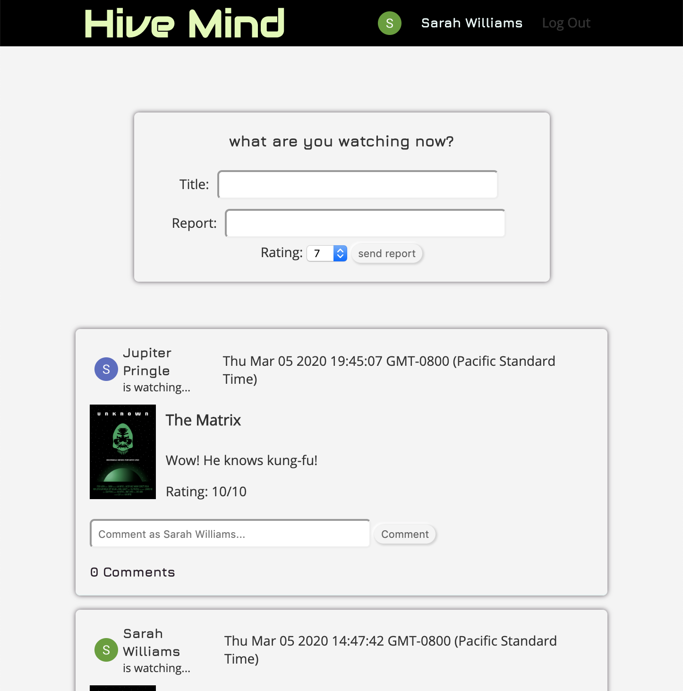
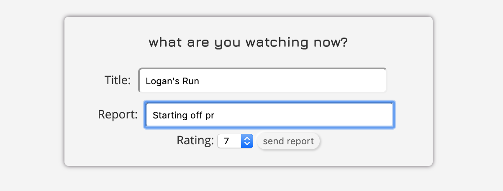
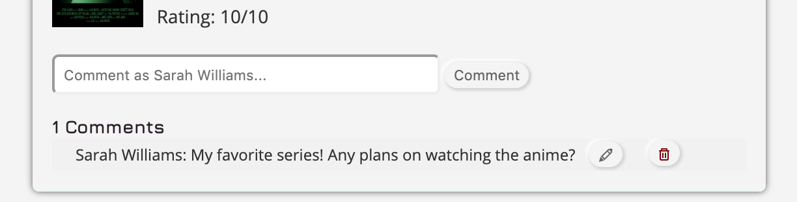
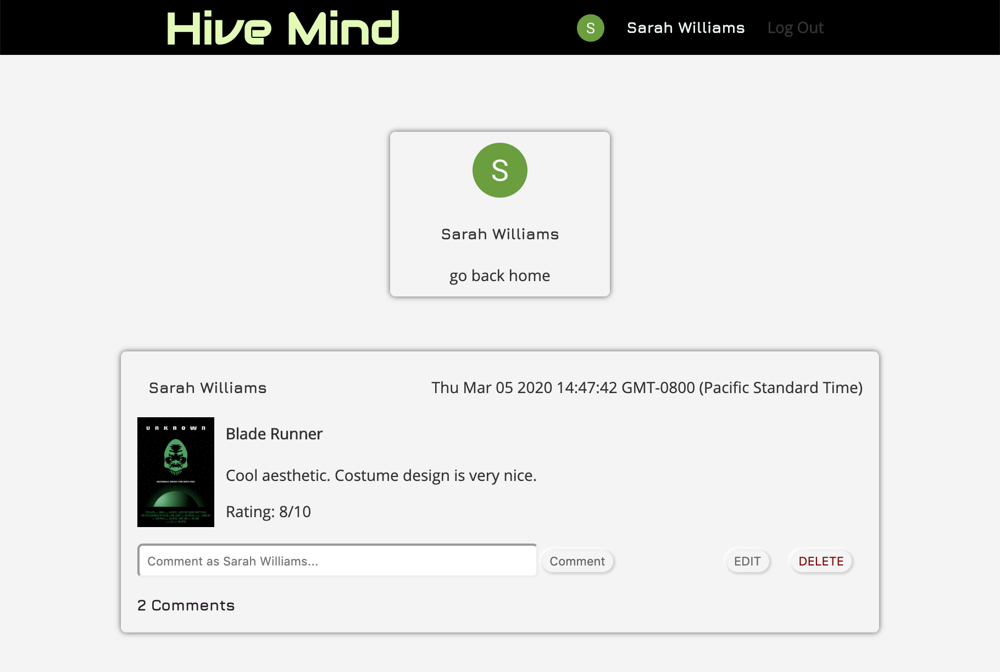

HiveMind
-

HiveMind is a community forum that allows SciFi fans to share what share what movie or tv show they are currently watching. A comment section is available on each report connect users with similar SciFi interests! Viewing other user's profiles displays that user's current and previously watched entertainment. 

#### Technologies Used:
Node.js, Express, MongoDB, Mongoose, Javascript, HTML, CSS

-

#### Getting Started:
Check it out on [Heroku](https://hive--mind.herokuapp.com/).
See some of the process on [Trello](https://trello.com/b/5dZ2a8ME/hive-mind).
View on [Github](https://github.com/arghmatey/Hive-Mind).

-

#### Next Steps:
Plans for the future include:

* Pulling entertainment information like posters, plots, and actors from the MovieBD API
* Features on the home page - who's online, most watched this week, etc.
* Private message boards between users that allows for direct recommendations and discussions
* "Watched" lists for each user 
* Video games and books available for posting - all scifi welcome!
